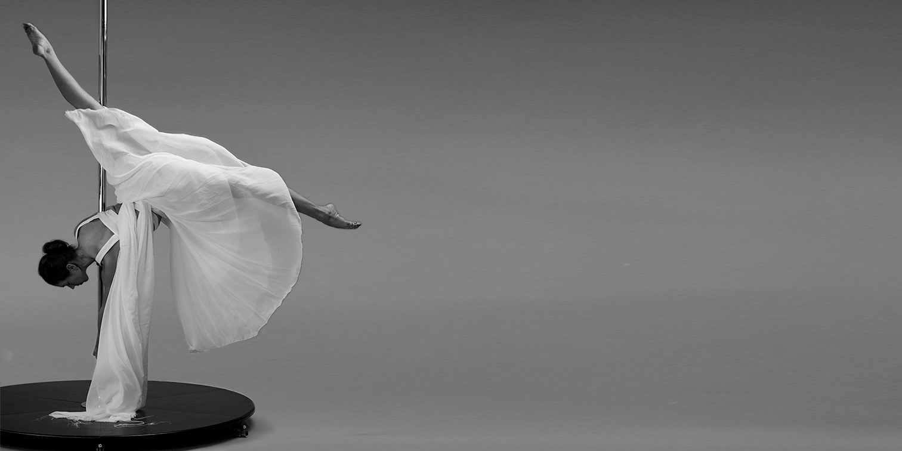

<!DOCTYPE html>
<html lang="da">
<head>
    <meta charset="UTF-8">
    <meta name="viewport" content="width=device-width, initial-scale=1.0">
    <title>Pole Fitness Forside</title>
    <link rel="stylesheet" href="style.css"> 
    
</head>
<body>
    <header>
        <h1><a href="index.html" style="text-decoration: none; color: black;">POLE-FITNESS</a></h1>
        <nav>
            <ul>
                <li><a href="fordele.html">Fordele ved pole</a></li>
                <li class="dropdown">
                    <a href="#">Pole for begyndere</a>
                    <ul class="dropdown-content">
                        <li><a href="begyndere1.html">Begynderens guide til pole</a></li>
                        <li><a href="begyndere2.html">Hvorfor jeg selv startede til pole</a></li>
                    </ul>
                </li>
                <li><a href="inspiration.html">Inspiration og tips</a></li>
                <li><a href="galleri.html">Galleri</a></li>
                <li><a href="kontakt.html">Kontakt og om os</a></li>
            </ul>
        </nav>
    </header>
    
    <main>
        <section class="hero">
            

                
            

            

                <h2>Pole fitness er den nye motions form som har taget Danmark med storm</h2>
                
Tilmeld dig i Pole Aarhus og mærk forskellen

                <a href="tilmelding.html" class="cta-button">Bliv medlem</a> 
            

        </section>
    </main>
</body>
</html>
